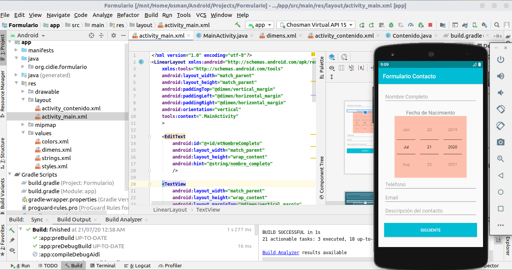
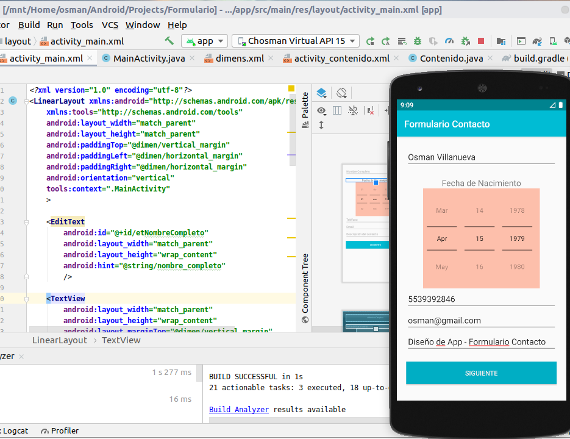
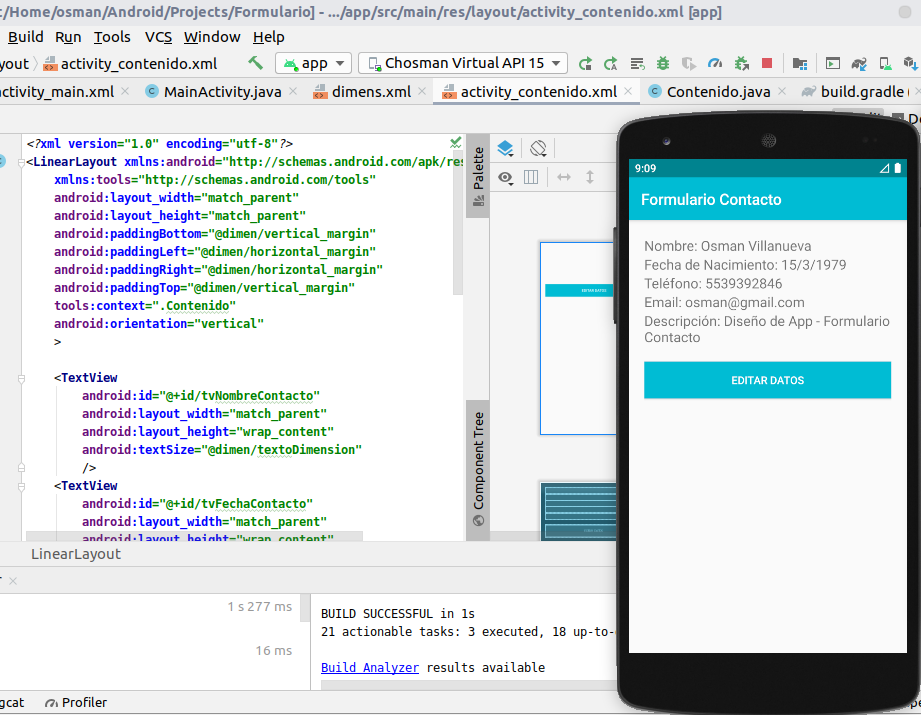
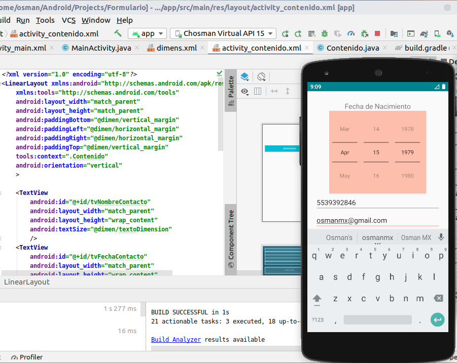
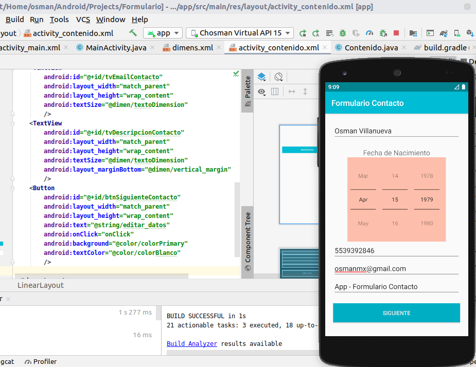
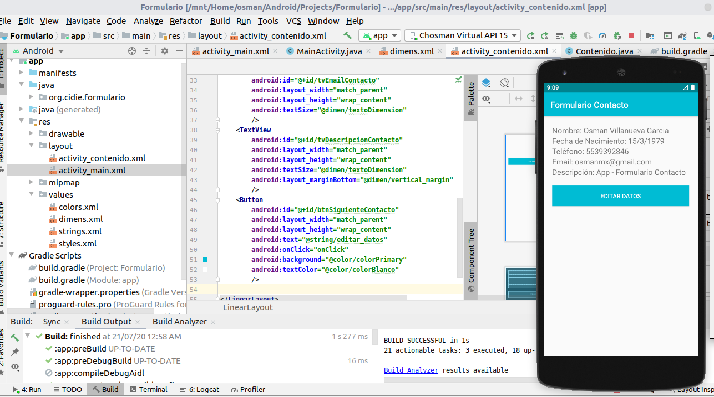

# Formulario_Contacto
Formulario Contacto Android Studio

Actividad 1 -
Formulario solicita:
Nombre,
Fecha de Nacimiento,
Email,
Descripción Contacto,
BOTÓN "Siguiente".

Actividad 2 -
Visualiza datos cargados de Actividad 1,
BOTÓN "Editar Datos".

Al dar cic en "Editar Datos" de la Actividad 2,
regresa Actividad 1 con los datos previos cargados y disponibles para edición (si aplica el caso). 
Se realizan modificaciones de los datos de contacto mediante en Actividad 1, y de nuevo clic en BOTÓN "Siguiente" 
para la correspondiente validación de datos a través de la Actividad 2. 
Se repite ciclo entre Actividad 1 y Actividad 2, y en esta segunda actividad el Botón de "REGRESAR" (hacia atrás) del dispositivo 
electrónico permite salir de la aplicación "Formulario Contacto".

Se anexan imágenes (formulario#.png) en directorio raíz de ejemplos al ejecutar aplicación en Android Studio.

    
    defaultConfig {
        applicationId "org.cidie.formulario"
        minSdkVersion 21
        targetSdkVersion 29
        versionCode 1
        versionName "1.0"
        testInstrumentationRunner "androidx.test.runner.AndroidJUnitRunner"
    }

## Captura de Pantalla - Formulario Contacto

    

        
    

 

    

        
    

 

    

        
    

 

    

        
    

 

    

        
    

 

    

        
    

